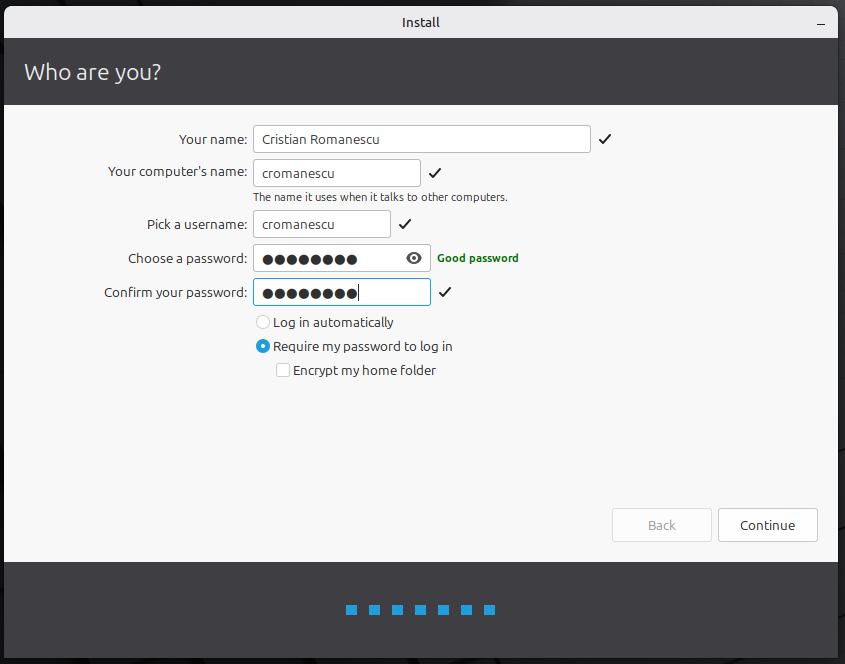

# Step 1. Install Linux Mint

Install the Linux Mint distribution on the target computer using the recommended [installation method](https://linuxmint-installation-guide.readthedocs.io/en/latest/) using the bootable disk.

## Recommended actions

1. Create the account for developer using his first name initial and last name (Cristian Romanescu => `cromanescu`)

After the installation is complete, there are two main methods to proceed with the installation and configuration of the PHP Developer Workstation:

a) Using Ansible remotely from your computer
b) Locally on the target computer

This guide is now following the first method, installing the packages remotely from your computer to the new target computer.

