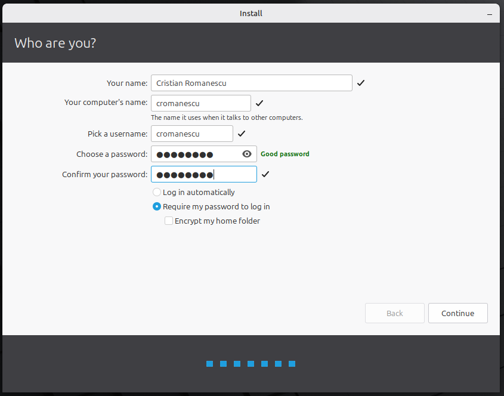

# Step 1. Install Linux Mint

Install the Linux Mint distribution on the target computer using the recommended [installation method](https://linuxmint-installation-guide.readthedocs.io/en/latest/) using the bootable disk.

## Recommended actions

1. Create the account for developer using his first name initial and last name (Cristian Romanescu => `cromanescu`) or use company policy rules on LDAP / SSO usernames.

2. For added security use LVM with encrypted key. This ensures the stolen laptop cannot be easily accessible. Also the encryption should use a good passphrase

Once the Linux installation is complete, proceed to the next step.

[Back](index.md)
